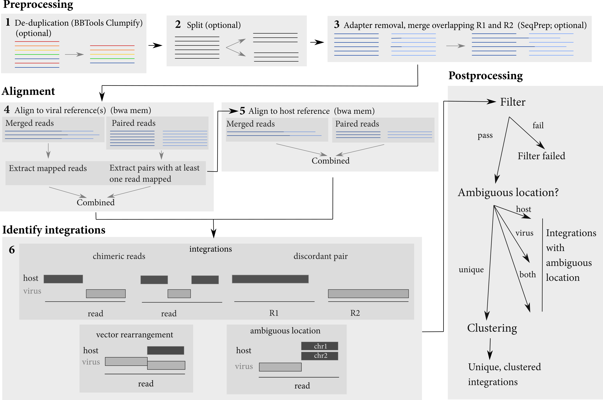

# Isling


Isling is a tool for detecting viral or vector integration in paired-end reads.

# Overview

The pipeline performs several steps in order to identify integration sites.  It takes as input datasets consisting of either fastq files or bam files. It does some pre-processing of the reads (merging overlapping reads, optional) and then aligns them to both a host and a viral sequence.  Reads are first aligned to the viral sequence(s), and then aligned reads are extracted and aligned to the host.  These alignments are used to identify viral integrations.



# Dependencies
Isling requires `snakemake` and either `singularity` (recommended) or `conda` to supply dependencies.  Additionaly, `python` version 3.5 or above and `pandas` are required (these should be automatically installed if installing `snakemake` with `conda`.

Alternativley, use the Docker version which contains isling and all dependencies.

# Running

To run with the (included) test data locally, run:

```
snakemake --configfile test/config/test.yml --cores <cores>
```

Alternatively, if you have docker installed, on MacOS you can run:

```
docker run --rm -it -v"$(pwd)"/out:/opt/isling/out szsctt/isling:latest snakemake --configfile test/config/test.yml --cores 1
```

This will use the config file and data inside the container, and the results will appear in a folder called `out` in your current working directory.  On Linux, you will need to run this command as root, and on Windows you will need to adjust the [bind-mount syntax](https://docs.docker.com/storage/bind-mounts/) (`-v` argument).

## Inputs

A config file, as well as the host and viral/vector references, and reads are required inputs.  Specify all inputs in a config file.

See the file `configfile.md` for a description of the format of this config file.

## Outputs

Isling outputs integration sites in a tab-separated format in the output directory specified in the config file.

### Files
 
Within the output folder, one folder is created for each dataset in the config file, and for each dataset, integrations can be found in the `ints` directory.  There will be one set of output files for each sample.

For each sample, there are a number of output files, which may be of interest for particular use-cases.

 - `<sample>.<host>.<virus>.integrations.txt`: information about all detected junctions, regardless of if they passed the filters or not
 - `<sample>.<host>.<virus>.integrations.post.txt`: information about detected junctions that passed all filters
 - `<sample>.<host>.<virus>.integrations.post.unique.txt`: information about detected junctions that passed all filters and have an unambiguous location in both host and vector/virus
 - `<sample>.<host>.<virus>.integrations.post.unique.merged.txt`: the result of merging overlapping junctions or junctions with the same coordinates in both host and virus/vector.  Merging is conducted with only the integration junctions that have an unambiguous location in both host and virus/vector.
 - `<sample>.<host>.<virus>.integrations.post.host_ambig.txt`: information about detected junctions that passed all filters and have an unambiguous location vector/virus but ambiguous location in host
 - `<sample>.<host>.<virus>.integrations.post.virus_ambig.txt`: information about detected junctions that passed all filters and have an unambiguous location host but ambiguous location in vector/virus
 - `<sample>.<host>.<virus>.integrations.post.both_ambig.txt`: information about detected junctions that passed all filters and have an ambiguous location in both host and vector/virus

### Columns

The output files give the location of the identified integrations, and their properties.  Coordinates for integration junctions are specified in terms of their ambiguous bases.  That is, there is often a gap or overlap between the host and viral portions of a read:


Since the location of the integration cannot be uniquely determined in this case, isling outputs the coordinates of these bases in the host and vector/virus genome as the location of the integration.

With the exception of the merged cluster output file, all files contain these columns:

 - Chr: Host chromosome/contig on which integration was identified
 - IntStart, IntStop: Coordinates of the ambiguous bases for the junction in the host
 - VirusRef: Viral reference involved in junction
 - VirusStart, VirusStop: Coordinates of the ambiguous bases for the juction in the viral reference
 - NoAmbiguousBases: Number of ambiguous bases
 - OverlapType: Specifies if the ambiguous bases occured because the junction was a `gap` or `overlap`  For a chimieric read (host and and viral parts identified on the same read), a junction is `clean` if it has no ambiguous bases. Alternatively, if the jucntion was identified in a discordant pair, the `OverlapType` is `discordant`
 - Orientation: The orientation of the integration relative to the host genome - either host/virus (`hv`) or virus/host (`vh`)
 - VirusOrientation: The orientation in which the viral portion was integrated - either `+` or `-`
 - HostSeq: The bases of the read that unambiguously come from the host
 - VirusSeq: The bases of the read that unambiguously come from the virus
 - AmbiguousSeq: The sequence of the ambiguous bases
 - HostEditDist: Edit distance (from `bwa`) of the host alignment
 - ViralEditDist: Edit distance (from `bwa`) of the viral alignment
 - TotalEditDist: The total edit distance; the sum of the host and viral edit distnace, plus the number of ambiguous bases if the `OverlapType` is `gap`
 - PossibleHostTranslocation: Could the read be explained as a translocation of the host genome?
 - PossibleVectorRearrangement: Could the read be explained as a rearrangement of the vector genome?
 - HostAmbiguousLocation: Are there other possible locations for the integration junction in the host genome?
 - ViralAmbiguousLocation: Are there other possible locations for the integration junction in the viral genome?
 - Type: is the junction observed in a  `chimeric` read, a `discordant` pair or is it a `short` integration in which both junctions were observed in the same read
 - HostMapQ: Mapping quality of the host alignment (from `bwa`)
 - ViralMapQ: Mapping quality of the viral alignment (from `bwa`)
 - AltLocs: If there are other possible locations for the integration junction in the host or viral genome (due to other equivalent alignments), they are given here
 - ReadSeq: Sequence of the read in which integration was observed.  For a discordant pair, the two reads are separated by the string `'xxx'`
 

## Benchmarking

To reproduce the figures in the isling manuscript, see the readme in the `benchmarking` directory.
	
