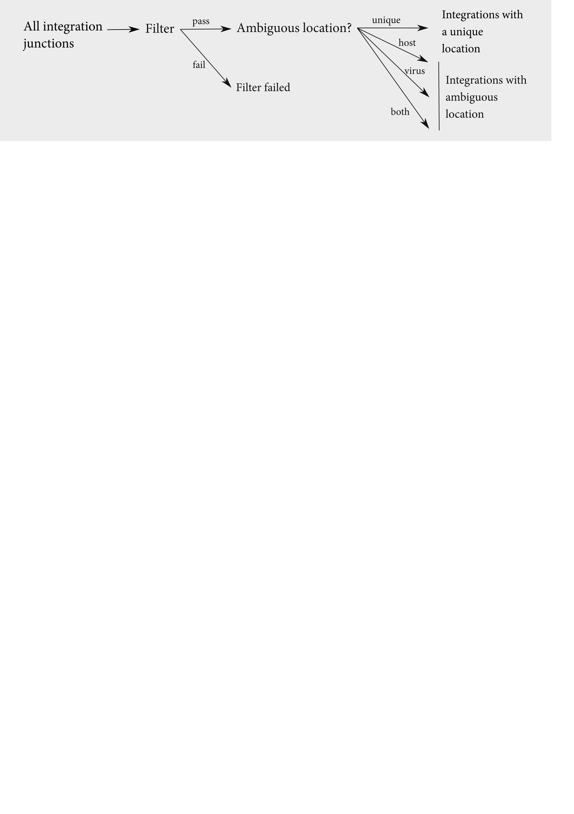
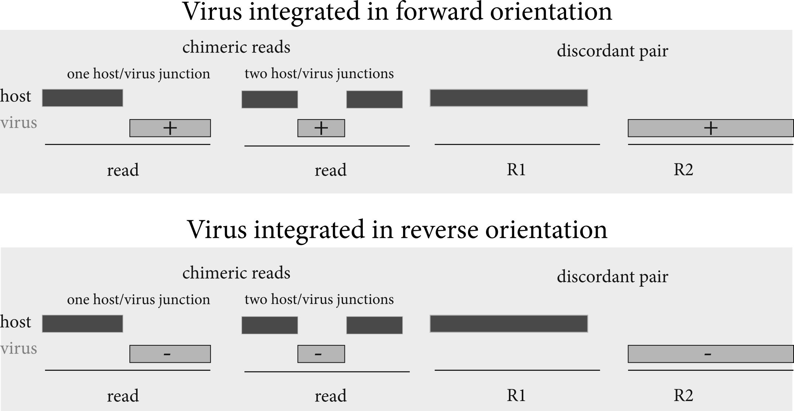
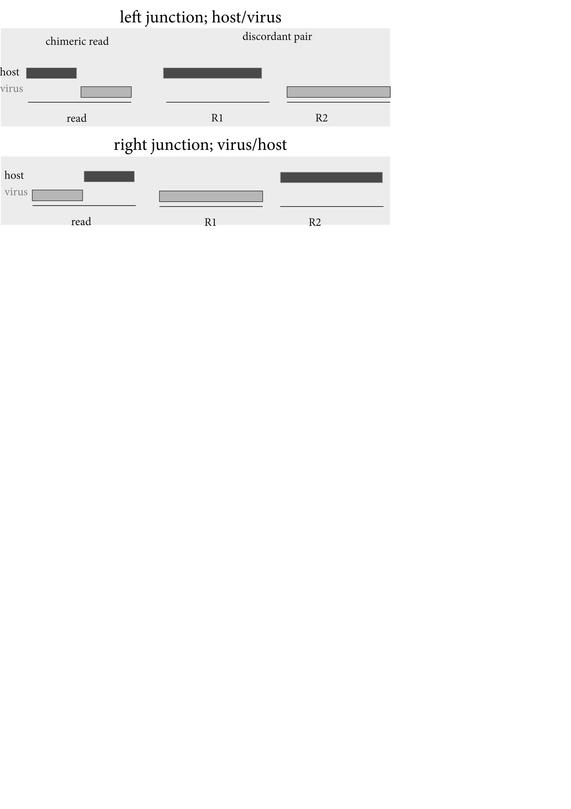

```{r, setup_junc_types, include=FALSE}
knitr::opts_chunk$set(fig.width=12, fig.height=8,
                      echo=FALSE, warning=FALSE, message=FALSE)
library(magrittr)

max_sample_length <- 10
max_contigs_plot <- 25

pal <- wesanderson::wes_palette("Royal1")
samp_pal <- wesanderson::wes_palette("Darjeeling1", length(unique(ints_wc$sample)), "continuous")

```

## Junction types

For this section, we examine all the integration junctions retained after filtering.  Each junction has a number of properties associated with it.  In this section we examine some of those properties.


```{r, wc_uniq, include=FALSE}
ints <- tibble::tibble(
  f = list.files(ints_dir, full.names=TRUE),
  type = dplyr::case_when(
    stringr::str_detect(f, "\\integrations\\.post\\.unique\\.txt") ~ "unique",
    stringr::str_detect(f, "\\integrations\\.post\\.virus_ambig\\.txt") ~ "ambig. (viral)",
    stringr::str_detect(f, "\\integrations\\.post\\.host_ambig\\.txt") ~ "ambig. (host)",   
    stringr::str_detect(f, "\\integrations\\.post\\.both_ambig\\.txt") ~ "ambig. (both)",  
    TRUE ~ as.character(NA)
  ),
  sample = stringr::str_extract(basename(f), glue::glue("^.+(?=\\.{Hmisc::escapeRegex(params$host)})")),
  sample_short = dplyr::case_when(
    stringr::str_length(sample) > max_sample_length ~ glue::glue("{stringr::str_sub(sample, end=max_sample_length)}..."),
    TRUE ~ sample
    )
) %>% 
  dplyr::filter(!is.na(type)) %>% 
  dplyr::filter(!(sample %in% exclude))

# count number of host/virus junctions in unique/ambiguous categories
ints_wc <- ints %>% 
  dplyr::filter(!is.na(type)) %>% 
  dplyr::mutate(count = purrr::map_dbl(f, ~as.integer(system2("wc", args = c("-l", .x,  " | awk '{print $1}'"), stdout=TRUE))-1)) %>% 
  tidyr::pivot_wider(names_from = "type", values_from = "count")


```


### Chimeric reads and discordant pairs

Counting the number of junctions that were observed in chimeric reads and discordant pairs.  For chimeric reads, we further stratify in the junction had a 'gap', 'overlap' or was a 'clean' junction.  

{width=75% height=75%}

We call any bases involved in a gap or overlap 'ambiguous bases', and since it is not possible to identify a precise location within those ambiguous bases, _isling_ reports the coordinates of the bases as the location of the integration.

```{r}
col_spec <- readr::cols(
  .default = readr::col_character(),
  IntStart = readr::col_double(),
  IntStop = readr::col_double(),
  VirusStart = readr::col_double(),
  VirusStop = readr::col_double(),
  NoAmbiguousBases = readr::col_double(),
  HostEditDist = readr::col_double(),
  ViralEditDist = readr::col_double(),
  TotalEditDist = readr::col_double(),
  PossibleHostTranslocation = readr::col_logical(),
  PossibleVectorRearrangement = readr::col_logical(),
  HostAmbiguousLocation = readr::col_logical(),
  ViralAmbiguousLocation = readr::col_logical(),
  HostMapQ = readr::col_double(),
  ViralMapQ = readr::col_double()
)


ints <- ints %>% 
  dplyr::mutate(data = purrr::map(f, ~readr::read_tsv(., col_types=col_spec, na = c("", "NA", "None")))) %>% 
  tidyr::unnest(data)
```


```{r include=FALSE}
ints %>% 
  ggplot2::ggplot(ggplot2::aes(y = sample_short, fill = Type)) +
  ggplot2::geom_bar(position=ggplot2::position_stack(reverse=TRUE)) +
  ggplot2::theme_classic() +
  ggplot2::theme(legend.position="bottom",
                 axis.line.y = ggplot2::element_blank(),
                 axis.ticks.y = ggplot2::element_blank(),
                 axis.title.y = ggplot2::element_blank())
```


```{r}
ints %>% 
  ggplot2::ggplot(ggplot2::aes(y = sample_short, fill = OverlapType)) +
  ggplot2::geom_bar(position=ggplot2::position_stack(reverse=TRUE)) +
  ggplot2::theme_classic() +
  ggplot2::theme(legend.position="bottom",
                 axis.line.y = ggplot2::element_blank(),
                 axis.ticks.y = ggplot2::element_blank(),
                 axis.title.y = ggplot2::element_blank()) +
  ggplot2::scale_fill_manual(values=pal)
```

If the junction is 'gap' or 'overlap', it has an associated number of ambiguous bases associated with it.  The distribution of the number of ambiguous bases looks like this:

```{r}

ints %>% 
  dplyr::filter(OverlapType == "gap" | OverlapType == "overlap") %>% 
  ggplot2::ggplot(ggplot2::aes(x = NoAmbiguousBases, color = sample_short)) +
  ggplot2::geom_freqpoly(bins=max(ints$NoAmbiguousBases, na.rm=TRUE)) +
  ggplot2::facet_grid(rows=ggplot2::vars(OverlapType)) +
  ggplot2::theme_classic() +
  ggplot2::theme(strip.background = ggplot2::element_blank()) +
  ggplot2::scale_color_manual(values=samp_pal) +
  ggplot2::xlab("number of ambiguous bases")
```

### Ambiguous/unique locations

We can also count the number of junctions that can be uniquely localised in both host and virus genomes, and those with locations that are ambiguous in one or both genomes. 

{width=75% height=75%}

Note the distinction between 'ambiguous bases', which refer to the bases that are part of a gap or overlap at an individual integration junction, and 'ambiguous location', which refers to host or viral alignments which cannot be uniquely localised in the respective genome.  These ambiguous locations occur because the mapping quality of the alignment is low, or because there are multiple best alignments for the read.

We divide integrations into four groups, depending on their locations in host and viral references:


| Group             | Host location | Virus location |
|-------------------|---------------|----------------|
| Unique            | Unambiguous   | Unambiguous    |
| Ambiguous (host)  | Ambiguous     | Unambiguous    |
| Ambiguous (virus) | Unambiguous   | Ambiguous      |
| Ambiguous (both)  | Ambiguous     | Ambiguous      |

Counting the number of junctions in each of these four groups:

```{r, echo=FALSE}
#DT::datatable(dplyr::select(ints_wc, -f), 
#              rownames = FALSE)
```


```{r}
ints_wc %>% 
  tidyr::pivot_longer(`ambig. (both)`:`ambig. (viral)`, names_to="type", values_to="count") %>% 
  dplyr::group_by(sample) %>% 
  dplyr::mutate(frac = count/sum(count)) %>% 
  dplyr::ungroup() %>% 
  ggplot2::ggplot(ggplot2::aes(y=sample_short, x=count, fill=type)) +
  ggplot2::geom_col(position=ggplot2::position_stack(reverse=TRUE)) +
  ggplot2::theme_classic() +
  ggplot2::theme(legend.position="bottom",
                 axis.line.y = ggplot2::element_blank(),
                 axis.ticks.y = ggplot2::element_blank(),
                 axis.title.y = ggplot2::element_blank()) +
  ggplot2::scale_fill_manual(values=pal)
```


### Location in viral reference(s)

We can also plot the location of the integrations in the viral reference (for those junctions with an unambiguous location in the host genome, i.e. the 'unique' group and the 'ambiguous (host)' group).  

We first plot the number of integration junctions identified in each viral reference.


```{r}
ints %>% 
  dplyr::filter(type == "unique" | type == "ambig. (host)") %>% 
  dplyr::mutate(VirusRef = forcats::as_factor(VirusRef)) %>% 
  dplyr::mutate(VirusRef = forcats::fct_relevel(VirusRef, ~stringr::str_sort(., numeric=TRUE))) %>% 
  ggplot2::ggplot(ggplot2::aes(fill = VirusRef, y=sample_short)) +
  ggplot2::geom_bar() +
  ggplot2::theme_classic() +
  ggplot2::theme(legend.position="bottom",
                 axis.line.y = ggplot2::element_blank(),
                 axis.ticks.y = ggplot2::element_blank(),
                 axis.title.y = ggplot2::element_blank())  +
  ggplot2::scale_fill_manual(values=rep_len(pal, length(unique(ints$VirusRef))))
  
```

```{r}
get_top_contigs <- function(col_name, contig_lengths) {
  contigs_join <- tibble::tibble(
    name = names(contig_lengths),
    length = unlist(unname(contig_lengths))
  )
  
  right_join <- "name"
  
  contigs_plot <- ints %>% 
    dplyr::filter(type == "unique" | type == "ambig. (virus)") %>% 
    dplyr::group_by(!!dplyr::sym(col_name)) %>% 
    dplyr::summarise(n = dplyr::n()) %>% 
    dplyr::arrange(desc(n)) %>% 
    head(max_contigs_plot) %>% 
    dplyr::left_join(contigs_join, by=setNames(right_join, col_name)) %>% 
    dplyr::mutate(start=1) %>% 
    dplyr::arrange(factor(!!dplyr::sym(col_name), levels=stringr::str_sort(!!dplyr::sym(col_name), numeric=TRUE)))
  
  return(contigs_plot)
}

```


We can also plot the location of integration junctions in each viral reference.  Since it's hard to visualise very many viral references, this plot is limited to the 25 viral references that harbor the most integration junctions.

{width=75% height=75%}

For each viral reference, the rectangles above the axis for each viral reference represent the coordinates of junctions where the virus as integrated in the forward (+) orientation, and those below the axis represent integrations in the reverse (-) direction.  Integration jucntions in red were observed in chimeric reads, and integration junctions in grey were observed in discordant pairs (and therefore represent approximate junction locations).


```{r include=FALSE}
ints %>% 
  dplyr::filter(type == "unique" | type == "ambig. (host)") %>% 
  ggplot2::ggplot(ggplot2::aes(x = VirusStart, color=sample_short)) +
  ggplot2::geom_density(bw=max(ints$VirusStop)/200) +
  ggplot2::facet_grid(cols=ggplot2::vars(VirusRef), rows=ggplot2::vars(VirusOrientation))+
  ggplot2::theme_classic() +
  ggplot2::theme(strip.background = ggplot2::element_blank()) +
  ggplot2::scale_color_manual(values=samp_pal)
```

```{r}
virus_contigs_plot <- get_top_contigs("VirusRef", virus_contigs)

virus_ints_plot <- ints %>% 
  dplyr::filter(type == "unique" | type == "ambig. (host)") %>% 
  dplyr::select(VirusRef, VirusStart, VirusStop, VirusOrientation, Type) 


virus_plot_fwd <- virus_ints_plot %>% 
  dplyr::filter(VirusOrientation == '+') %>% 
  dplyr::arrange(Type) %>% 
  GenomicRanges::makeGRangesFromDataFrame(
   seqnames.field = "VirusRef",
   start.field = "VirusStart",
   end.field = "VirusStop",
   strand.field= "VirusOrientation",
   starts.in.df.are.0based = TRUE,
   keep.extra.columns = TRUE
  )

virus_plot_fwd_discord <- virus_ints_plot %>% 
  dplyr::filter(VirusOrientation == '+') %>% 
  dplyr::filter(Type=="discordant") %>% 
  GenomicRanges::makeGRangesFromDataFrame(
   seqnames.field = "VirusRef",
   start.field = "VirusStart",
   end.field = "VirusStop",
   strand.field= "VirusOrientation",
   starts.in.df.are.0based = TRUE,
   keep.extra.columns = TRUE
  )

virus_plot_fwd_chimeric <- virus_ints_plot %>% 
  dplyr::filter(VirusOrientation == '+') %>% 
  dplyr::filter(Type!="discordant") %>% 
  GenomicRanges::makeGRangesFromDataFrame(
   seqnames.field = "VirusRef",
   start.field = "VirusStart",
   end.field = "VirusStop",
   strand.field= "VirusOrientation",
   starts.in.df.are.0based = TRUE,
   keep.extra.columns = TRUE
  )

virus_plot_rev_discord <- virus_ints_plot %>% 
  dplyr::filter(VirusOrientation == '-') %>% 
  dplyr::filter(Type=="discordant") %>% 
  GenomicRanges::makeGRangesFromDataFrame(
   seqnames.field = "VirusRef",
   start.field = "VirusStart",
   end.field = "VirusStop",
   strand.field= "VirusOrientation",
   starts.in.df.are.0based = TRUE,
   keep.extra.columns = TRUE
  )

virus_plot_rev_chimeric <- virus_ints_plot %>% 
  dplyr::filter(VirusOrientation == '-') %>% 
  dplyr::filter(Type!="discordant") %>% 
  GenomicRanges::makeGRangesFromDataFrame(
   seqnames.field = "VirusRef",
   start.field = "VirusStart",
   end.field = "VirusStop",
   strand.field= "VirusOrientation",
   starts.in.df.are.0based = TRUE,
   keep.extra.columns = TRUE
  )


custom.genome <- regioneR::toGRanges(data.frame(chr=names(virus_contigs), 
                                      start=rep(1, length(virus_contigs)), 
                                      end=unname(unlist(virus_contigs))
                                      )
                           )

kp <- karyoploteR::plotKaryotype(genome = custom.genome, plot.type=2)
#karyoploteR::kpPlotDensity(kp, virus_ints_plot, window.size=100)


karyoploteR::kpPlotRegions(kp, virus_plot_fwd_discord, col=pal[1], data.panel=1, border="slategray", r0=0, r1=0.45)
karyoploteR::kpPlotRegions(kp, virus_plot_fwd_chimeric, col=pal[2], data.panel=1, r0=0.55, r1=1)
karyoploteR::kpPlotRegions(kp, virus_plot_rev_discord, col=pal[1], data.panel=2, border="slategray", r0=0, r1=0.45)
karyoploteR::kpPlotRegions(kp, virus_plot_rev_chimeric, col=pal[2], data.panel=2, r0=0.55, r1=1)


```

### Location in host genome

We can also look at the location of integration junctions in the host genome - for this we use the integration junctions that have a unique location in the host genome (the 'unique' and 'ambiguous (viral)' subsets).

First, count the number of integrations on each contig in the host reference:

```{r fig.height=7}
ints %>% 
  dplyr::filter(type == "unique" | type == "ambig. (virus)") %>% 
  dplyr::mutate(Chr = forcats::as_factor(Chr)) %>% 
  dplyr::mutate(Chr = forcats::fct_relevel(Chr, ~stringr::str_sort(., numeric=TRUE))) %>% 
  ggplot2::ggplot(ggplot2::aes(fill = Chr, y=sample_short)) +
  ggplot2::geom_bar(position=ggplot2::position_stack(reverse=TRUE)) +
  ggplot2::theme_classic() +
  ggplot2::theme(legend.position="bottom",
                 axis.line.y = ggplot2::element_blank(),
                 axis.ticks.y = ggplot2::element_blank(),
                 axis.title.y = ggplot2::element_blank()) +
  ggplot2::scale_fill_manual(values=rep_len(pal, length(unique(ints$Chr))))
```
```{r fig.height=30}
#ints %>% 
#  dplyr::filter(type == "unique" | type == "ambig. (virus)") %>% 
#  ggplot2::ggplot(ggplot2::aes(x = IntStart, color=sample_short)) +
#  ggplot2::geom_freqpoly(bins = 10000) +
#  ggplot2::facet_grid(rows=ggplot2::vars(Chr), cols=ggplot2::vars(Orientation))+
#  ggplot2::theme_classic() +
#  ggplot2::theme(strip.background = ggplot2::element_blank())
```


Next, we plot the location of the integrations in the host genome.  Since a lot of contigs can make this plot difficult to view, we only use the top `r max_contigs_plot` contigs (ranked by number of integrations).


{width=60% height=60%}


Similar to above, we plot the integration coordinates for left, or host/virus junctions, on top, and those for right or virus/host junctions below.  Again, integration jucntions in red were observed in chimeric reads, and integration junctions in grey were observed in discordant pairs (and therefore represent approximate junction locations).


```{r}


host_contigs_plot <- get_top_contigs("Chr", host_contigs) 

host_plot_fwd_discord <- ints %>% 
  dplyr::filter(type == "unique" | type == "ambig. (virus)") %>% 
  dplyr::select(Chr, IntStart, IntStop, Orientation, Type) %>%
  dplyr::mutate(Orientation = dplyr::case_when(
    Orientation == "hv" ~ '+',
    Orientation == "vh" ~ '-'
  )) %>% 
  dplyr::filter(Chr %in% host_contigs_plot$Chr) %>% 
  dplyr::filter(Orientation == '+') %>% 
  dplyr::filter(Type=="discordant") %>% 
  GenomicRanges::makeGRangesFromDataFrame(
   seqnames.field = "Chr",
   start.field = "IntStart",
   end.field = "IntStop",
   strand.field= "Orientation",
   starts.in.df.are.0based = TRUE,
   keep.extra.columns = TRUE
  )

host_plot_fwd_chimeric <- ints %>% 
  dplyr::filter(type == "unique" | type == "ambig. (virus)") %>% 
  dplyr::select(Chr, IntStart, IntStop, Orientation, Type) %>%
  dplyr::mutate(Orientation = dplyr::case_when(
    Orientation == "hv" ~ '+',
    Orientation == "vh" ~ '-'
  )) %>% 
  dplyr::filter(Chr %in% host_contigs_plot$Chr) %>% 
  dplyr::filter(Orientation == '+') %>% 
  dplyr::filter(Type!="discordant") %>% 
  GenomicRanges::makeGRangesFromDataFrame(
   seqnames.field = "Chr",
   start.field = "IntStart",
   end.field = "IntStop",
   strand.field= "Orientation",
   starts.in.df.are.0based = TRUE,
   keep.extra.columns = TRUE
  )

host_plot_rev_discord <- ints %>% 
  dplyr::filter(type == "unique" | type == "ambig. (virus)") %>% 
  dplyr::select(Chr, IntStart, IntStop, Orientation, Type) %>%
  dplyr::mutate(Orientation = dplyr::case_when(
    Orientation == "hv" ~ '+',
    Orientation == "vh" ~ '-'
  )) %>% 
  dplyr::filter(Chr %in% host_contigs_plot$Chr) %>% 
  dplyr::filter(Orientation == '-') %>% 
  dplyr::filter(Type=="discordant") %>% 
  GenomicRanges::makeGRangesFromDataFrame(
   seqnames.field = "Chr",
   start.field = "IntStart",
   end.field = "IntStop",
   strand.field= "Orientation",
   starts.in.df.are.0based = TRUE,
   keep.extra.columns = TRUE
  )

host_plot_rev_chimeric <- ints %>% 
  dplyr::filter(type == "unique" | type == "ambig. (virus)") %>% 
  dplyr::select(Chr, IntStart, IntStop, Orientation, Type) %>%
  dplyr::mutate(Orientation = dplyr::case_when(
    Orientation == "hv" ~ '+',
    Orientation == "vh" ~ '-'
  )) %>% 
  dplyr::filter(Chr %in% host_contigs_plot$Chr) %>% 
  dplyr::filter(Orientation == '-') %>% 
  dplyr::filter(Type!="discordant") %>% 
  GenomicRanges::makeGRangesFromDataFrame(
   seqnames.field = "Chr",
   start.field = "IntStart",
   end.field = "IntStop",
   strand.field= "Orientation",
   starts.in.df.are.0based = TRUE,
   keep.extra.columns = TRUE
  )

custom.genome <- regioneR::toGRanges(data.frame(chr=host_contigs_plot$Chr, 
                                      start=host_contigs_plot$start, 
                                      end=host_contigs_plot$length
                                      )
                           )

kp <- karyoploteR::plotKaryotype(genome = custom.genome, plot.type=2)
karyoploteR::kpPlotRegions(kp, host_plot_fwd_discord, col=pal[1], data.panel=1, border="slategray", r0=0, r1=0.45)
karyoploteR::kpPlotRegions(kp, host_plot_fwd_chimeric, col=pal[2], data.panel=1, r0=0.55, r1=1)
karyoploteR::kpPlotRegions(kp, host_plot_rev_discord, col=pal[1], data.panel=2, border="slategray", r0=0, r1=0.45)
karyoploteR::kpPlotRegions(kp, host_plot_rev_chimeric, col=pal[2], data.panel=2, r0=0.55, r1=1)
```

