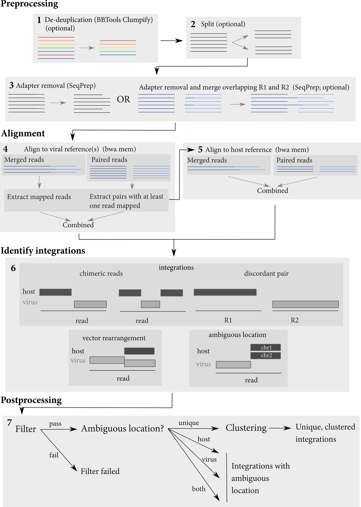

```{r, setup, include=FALSE}
print("started!")

knitr::opts_chunk$set(fig.width=8, fig.height=6,
                      echo=FALSE, warning=FALSE, message=FALSE)
library(magrittr)
source("summary_funcs.R")
```

---
date: `r format(Sys.time(), "%a %d %b %Y")`
---

## Overview

The goal of integration site analysis with _isling_ is to identify host/virus jucntions in sequence datas.  These host/virus junctions are evidence for viral integration into a host genome. The main steps in integration site analysis with _isling_ are shown below:


{width=80% height=80%}

## Datasets

First, an overview of the datasets analysed:

```{r}
# get analysis conditions for each dataset

conds <-tibble::tibble( 
  f = list.files(params$summary_dir, pattern="\\.analysis_conditions\\.tsv", full.names=TRUE),
  dataset = stringr::str_match(basename(f),  "(.+)(?=\\.analysis_conditions\\.tsv)")[,2],
  conds = purrr::map(f, ~readr::read_tsv(.)),
  n = purrr::map_dbl(conds, nrow),
  host = purrr::map_chr(conds, ~unique(.$host)),
  virus = purrr::map_chr(conds, ~unique(.$virus)),  
  samples = purrr::map_chr(conds, ~paste0(unique(.$sample), collapse=", "))
) %>%
  dplyr::filter(dataset %in% params$datasets)


```

```{r}
conds %>% 
  dplyr::select(-one_of("f", "conds", "samples")) %>% 
DT::datatable(rownames = FALSE)
```


## Number of host/virus junctions identified

Isling identifies host/virus junctions in chimeric reads and discordant pairs.  First, looking at the total number of junctions identified in each dataset.  Note that at first, we count all identified junctions

```{r, wc, include=FALSE}
ints_dir <- normalizePath(params$summary_dir)
datasets_dirs <- file.path(dirname(ints_dir), conds$dataset, "ints")
                           
ints_wc <- tibble::tibble(
  dataset = conds$dataset,
  dir = file.path(dirname(ints_dir), conds$dataset, "ints"),
  files = purrr::map(dir, ~list.files(., full.names=TRUE))
) %>% 
  tidyr::unnest(files) %>% 
  dplyr::mutate(type = dplyr::case_when(
    stringr::str_detect(files, "\\.integrations\\.txt$") ~ "total putative junctions",
    stringr::str_detect(files, "\\integrations\\.post\\.txt") ~ "junctions passing filters",
    )
  ) %>% 
  dplyr::filter(!is.na(type)) %>% 
  dplyr::mutate(count = purrr::map_dbl(files, ~as.integer(system2("wc", args = c("-l", .x,  " | awk '{print $1}'"), stdout=TRUE))-1)) 
```

```{r summariseWC}
ints_wc <- ints_wc %>% 
  dplyr::group_by(dataset, type) %>% 
  dplyr::summarise(count = sum(count)) %>% 
  dplyr::ungroup() %>% 
  tidyr::pivot_wider(names_from = "type", values_from = "count") %>% 
  dplyr::rowwise() 

print(ints_wc)

ints_wc <- ints_wc %>% 
  dplyr::mutate("junctions failing filters" = `total putative junctions` - `junctions passing filters`) %>%
  dplyr::ungroup()
```

There were a total of `r sum(ints_wc['junctions passing filters'])` junctions identified for all datasets.


First, count the number of host/virus junctions identified in chimeric reads or discordant read-pairs.  
```{r, displayWC, echo=FALSE}
ints_wc %>% 
  DT::datatable(rownames = FALSE)
```


```{r filter_statement, include=FALSE}
exclude <- ints_wc %>% 
  dplyr::filter(`junctions passing filters` == 0) %>% 
  dplyr::pull(dataset)


exclude_statement <- ifelse(length(exclude)==0,
                            glue::glue("All datasets had at least one host/virus junction that passed all filters"),
                            glue::glue("Datasets {paste0(exclude, collapse=', ')} had no host/virus junctions that passed all filters"))

```

`r print(exclude_statement)`.


```{r, ints_files, include=FALSE}
col_spec <- readr::cols(
  .default = readr::col_character(),
  IntStart = readr::col_double(),
  IntStop = readr::col_double(),
  VirusStart = readr::col_double(),
  VirusStop = readr::col_double(),
  NoAmbiguousBases = readr::col_double(),
  HostEditDist = readr::col_double(),
  ViralEditDist = readr::col_double(),
  TotalEditDist = readr::col_double(),
  PossibleHostTranslocation = readr::col_logical(),
  PossibleVectorRearrangement = readr::col_logical(),
  HostAmbiguousLocation = readr::col_logical(),
  ViralAmbiguousLocation = readr::col_logical(),
  HostMapQ = readr::col_double(),
  ViralMapQ = readr::col_double()
)


ints <- tibble::tibble(
  dir = datasets_dirs,
  dataset = purrr::map(dir, ~basename(dirname(.))),
  f = purrr::map(dir, ~list.files(., full.names = TRUE))
  ) %>% 
  tidyr::unnest(f) %>% 
  dplyr::mutate(type = dplyr::case_when(
    stringr::str_detect(f, "\\integrations\\.post\\.unique\\.txt") ~ "unique",
    stringr::str_detect(f, "\\integrations\\.post\\.virus_ambig\\.txt") ~ "ambig. (viral)",
    stringr::str_detect(f, "\\integrations\\.post\\.host_ambig\\.txt") ~ "ambig. (host)",   
    stringr::str_detect(f, "\\integrations\\.post\\.both_ambig\\.txt") ~ "ambig. (both)",  
    TRUE ~ as.character(NA)
  )) %>% 
  dplyr::filter(!is.na(type)) %>% 
  dplyr::mutate(data = purrr::map(f, ~readr::read_tsv(., col_types=col_spec, na = c("", "NA", "None")))) %>% 
  tidyr::unnest(data) %>% 
  tidyr::unnest(dataset)
```


```{r, intProperties, echo=FALSE, results='asis'}
# if there were some samples with integrations
 if (length(exclude) != nrow(ints_wc)) {
 res <- knitr::knit_child('summary_all_juncs.Rmd', quiet = TRUE)
 cat(res, sep = '\n')
 }
```

## Junction locations

Next, examine the location of identified integration locations in both host and vector.

```{r, intLocs, echo=FALSE, results='asis'}

get_bwa_prefix <- function(type, name) {
  return(
    conds %>% 
      dplyr::select(conds) %>% 
      tidyr::unnest(conds) %>% 
      dplyr::filter(!!dplyr::sym(type) == name) %>% 
      dplyr::pull(!!dplyr::sym(glue::glue("{type}_prefix"))) %>% 
      unique() 
  )
}

# if there were some samples with integrations
if (length(exclude) != nrow(ints_wc)) {

  locs_type  <- "host"
  plot_var <- "Chr"
  for (host in unique(conds$host)) {

    locs_name <- host

    if (params$bucket == ""){
      locs_bwa_prefix <- paste(params$workdir,get_bwa_prefix(locs_type, locs_name), sep = "/")
    }else{
      tmpPath <- getwd()
      setwd(dirname(tmpPath))
      locs_bwa_prefix <- paste(params$bucket,get_bwa_prefix(locs_type, locs_name), sep = "/")
    } 

    contigs <- get_contig_lengths(locs_bwa_prefix)     
    contigs_plot <- get_top_contigs(ints, plot_var, contigs)
    if (nrow(contigs_plot) > 0) {
      res <- knitr::knit_child('summary_all_locs.Rmd', quiet = TRUE)
      cat(res, sep = '\n')
    }
}

  locs_type  <- "virus"
  plot_var <- "VirusRef"
  for (virus in unique(conds$virus)) {

    locs_name <- virus
    if (params$bucket == ""){
      locs_bwa_prefix <- paste(params$workdir,get_bwa_prefix(locs_type, locs_name), sep = "/")
    }else{
      tmpPath <- getwd()
      setwd(dirname(tmpPath))
      locs_bwa_prefix <- paste(params$bucket,get_bwa_prefix(locs_type, locs_name), sep = "/")
    }
    contigs <- get_contig_lengths(locs_bwa_prefix)     
    contigs_plot <- get_top_contigs(ints, plot_var, contigs)

    if (nrow(contigs_plot) > 0) {
      res <- knitr::knit_child('summary_all_locs.Rmd', quiet = TRUE)
      cat(res, sep = '\n')
    }
  }
}


```


## Session info

The following is information about the R session and packages used:
```{r}
sessionInfo()
```


